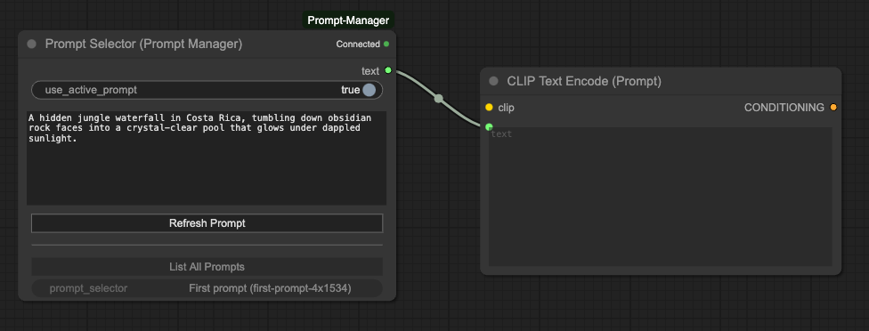

# Prompt Manager nodes for ComfyUI

Custom nodes for integrating [Prompt Manager](https://www.prompts.rodeo) with ComfyUI. Allows for prompts from the Prompt Manager to be piped directly into ComfyUI with automatic syncing as prompts are changed.

Provides two new nodes:

- Prompt Selector: allows individual prompts to be selected and loaded. Also has a toggle to stay in sync with whichever prompt is currently active in the Prompt Manager.
- Snapshot Selector: allows prompt snapshots to be selected and loaded.

Both nodes will load in string values which can then be connected to anything that can take a string input (CLIP node, T5 node, etc.).



## What's a Prompt Manager

[It's this thing.](https://www.prompts.rodeo)

If you write a lot of prompts for diffusion models (Stable Diffusion, FLUX, etc.), you end up with a horrible mess of text bits for different things. The Prompt Manager is intended to bring some order to that chaos while also providing a bunch of tools for generating and transforming text content.

Basic things it does:

- Basic organization: compose prompts from text blocks and organize with folders, types and custom labels. Fully searchable across everything.
- Blocks: Allows prompts to be built from small text blocks that can be easily added/deleted/rearranged/disabled
- Transformations: Easily generate new block content via LLMs, transform existing content in various ways, explore text variations, etc.
- Wildcards: Import and inject wildcards into block content. Also provides a nice interface for randomizing wildcards/selecting specific options/freezing specific wildcards, etc.
- Generate wildcards: Generate a new wildcard in seconds based on anything you like and immediately start using the new wildcard in your prompt content.
- Revisions: supports full revision history for text blocks and prompts. Easily tell what changed between versions and roll back to a previous version.
- Templates: Have a particular block arrangement you tend to use a lot? Create a template from it and use that combination as a starting point with a single click.
- Snapshots: Create a named, static snapshot of a prompt for moments when you stumble across a prompt that really nails what you were going for. Won't change if the parent prompt it came from does later.

## Prompt Manager Setup

Before you can use these nodes, you need to do the following:

- Go to https://www.prompts.rodeo.
- Make a free account (takes one click).
- Go to [the Account page](https://www.prompts.rodeo/account).
- Click on Generate API Key under ComfyUI API Key and copy it.

## ComfyUI Setup

- Make sure Prompt Manager is open in a browser tab and you're logged in — the pairing step below needs an active session to complete.
- In ComfyUI, go into Settings -> Prompt Manager and paste in the API key from above.
- A popup should appear on the Prompt Manager side asking you to confirm the pairing with ComfyUI. This is what hands the ComfyUI extension the key it needs to decrypt your prompts on its end. Accept the request, and you should get a confirmation on the ComfyUI side with the node connection status showing as Connected.
- Two new nodes should be available under Add Node -> PromptManager, Prompt Selector and Snapshot Selector. Start with Prompt Selector if you're using this for the first time.
- If everything went according to plan, you should see a green Connected status in the upper-right corner of the node.
- Click List All Prompts to load all of your prompts from Prompt Manager, then click the dropdown below that to select one. This should populate the node with the prompt contents.
- Connect the `text` output from the Prompt Manager node to the `text` input on your CLIP Text Encode node (or whatever text encoder node you're using). See screenshot above.
- Start generating images. Any changes you make to the prompt content in Prompt Manager should automatically sync to ComfyUI.
- Toggle on `use_active_prompt` to have the ComfyUI node always stay in sync with the current active prompt in Prompt Manager (allows you to flip between multiple prompts without having to manually change the prompt in the ComfyUI node).

## Manual Dependency Installation

Dependencies (`requests`, `python-dotenv`) should install automatically when ComfyUI loads the extension for the first time. If that doesn't work for some reason, you can install them manually:

```bash
cd ComfyUI/custom_nodes/Prompt-Manager-ComfyUI
pip install -r requirements.txt
```
